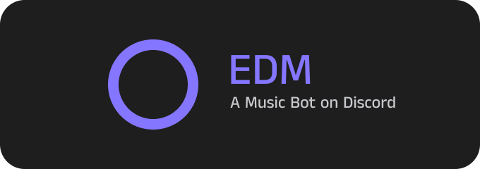
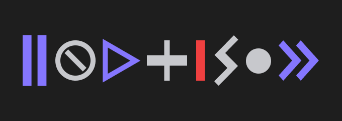

# EDM

 
A discord muisic bot that supports searching Spotify tracks, playlists, and albums and playing the search results using YouTube Music.

## Teckstack

### Libraries

- Discord.js
- @discordjs/voice
- spotify-web-api-node
- youtube-sr

## Design

 
All of the design is implemented via [Figma](https://www.figma.com/file/gGsq12IPP7y7EUTlttVfgI/EDM?type=design&mode=design&t=fZaiR7ccPyIU5ZAu-1), snippets below:
  

